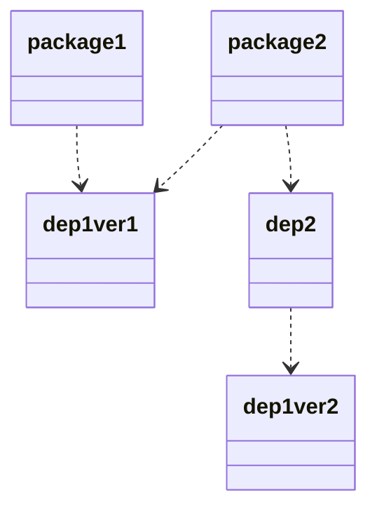
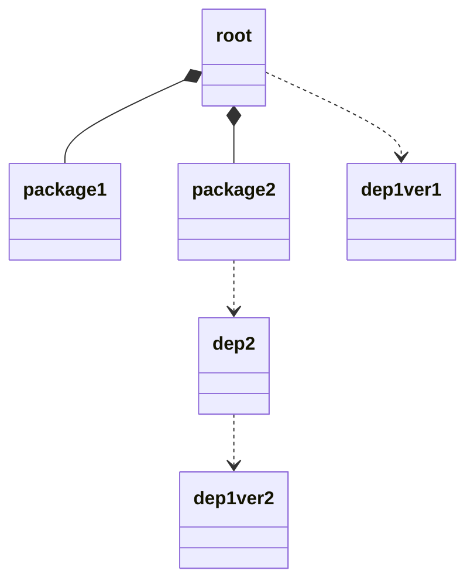

import {LocalizedLink} from '../../../src/i18n'

<!-- vim-markdown-toc GFM -->

- [不同版本的依赖](#不同版本的依赖)

<!-- vim-markdown-toc -->

[YARN workspaces][workspace]是现今最底层的 monorepo 技术。虽然它发布在[lerna][lerna]之后，它仍然与其它竞品一样完善好用。

本文仅记录在我的使用[workspaces][workspace]过程中发现的一些重要的点，因此入门级的教程不会记录再次。基本知识请咨[官方文档][workspace]。

# 不同版本的依赖

monorepo 的一个非常常见的卖点是所有子包都共享同一依赖池，因此在不同子包中统一管理依赖版本的开销非常小。但是实践中并不是完全没有问题。

在我的一个 monorepo 中，2 个子包都依赖于同一个依赖的同一个版本。但是麻烦的点在于其中一个子包的另一个依赖却依赖于前一个依赖的另一个版本。

上面的关系图展示了包与依赖之间的关系。在这个案例中`dep 1`的两种版本都需要安装。

实际中我发现`dep 2`所依赖的那个版本被安装在根目录，这可能会导致一些问题。假如`dep 1`是 typescript，且你使用 VSCode 的 tsserver 插件辅助编程，tsserver 会使用根目录下安装的 typescript 来做类型检查。但是在子包中编译代码时使用的 typescript 编译器却是各自直接依赖的版本。因此在 IDE 中通过检查的代码可能在实际编译中报错。

对此问题，我的解决方案是将`dep 1`从子包中提取出来并安装在根目录下。

这个方案强制在根目录下安装正确的版本的`dep 1`。但有一些限制条件。

1. 此依赖必须是 devDep，否则通过 npm registry 安装子包的项目会丢失一个依赖。一个临时解决方案是将此依赖加入子包中。但是这意味着开发环境下的依赖和生产环境下的依赖其实是不同的，你必须小心保持二者的同步。
2. 所有使用此依赖的子包都必须依赖同一个版本，因为根目录下只能安装一个版本。

希望 tsserver 和 IDE 们尽快适配这个场景。

[workspace]: https://classic.yarnpkg.com/en/docs/workspaces/
[lerna]: https://github.com/lerna/lerna
