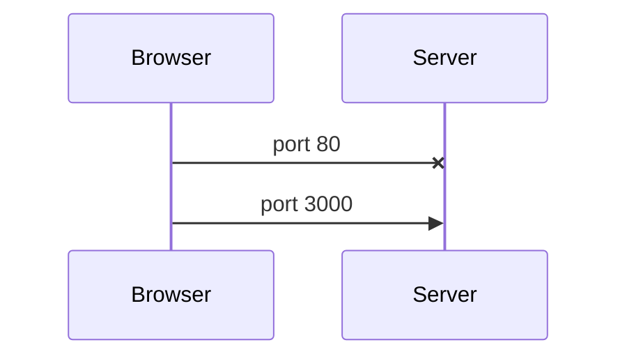
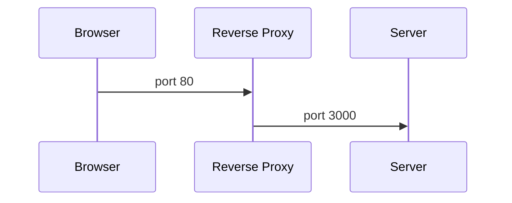
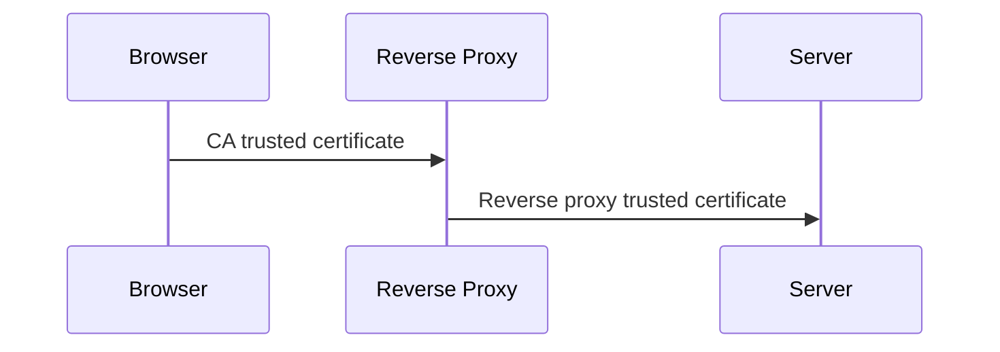
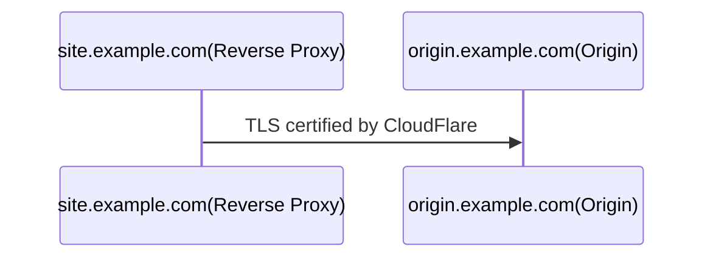

import {LocalizedLink} from '../../../src/i18n'

<!-- vim-markdown-toc GFM -->

- [原则](#原则)
  - [使用非常规端口](#使用非常规端口)
  - [反向代理](#反向代理)
  - [TLS](#tls)
- [推荐实践](#推荐实践)
  - [选择服务提供商](#选择服务提供商)
  - [源站的 TLS](#源站的-tls)
  - [反代](#反代)

<!-- vim-markdown-toc -->

在一些国家和地区，所有的网站、域名和 IP 都必须备案等级，否则不允许提供网站服务。这个规则有一些无可替代的好处，比如可以轻易追踪到诸如散播恐怖或黄色信息的网站的负责人。但对于开发者来说还是有一些不方便的地方。

举个例子，一个项目可能会需要一个测试服务器。如果测服也需要走完备案等级全流程的话，先不说等级被拒的可能性带来的额外支出，单单是走流程就需要额外延长开发周期。更为严重的是，每一个网站都需要注册独立的测服，因为管局需要定期检查网站的内容是否与备案时一致。

这里仅记录一些绕过域名和服务器监管的技术。这些记录可能会跟随现状实时变化。**为了他人的自由，请在法律范围内使用这些技术！**

# 原则

本章记录解决问题所需的一些原则。基于这些原则可以有很多种具体实现方式。

## 使用非常规端口

监管通常采用的实时监控手段都基于对指向特定端口的流量的扫描，并将未备案的流量封锁。因此一个直观的方案就是采用非常规的端口以绕过监管。网络上端口的总数以及庞大多样的流量让全量实时分析监控成为一个不可能的任务，因此指向非常规端口的流量默认都会被放行。这也是所有延申方案的基石。



但是非常规的端口在使用中会带来一些不便。

1. 访问者需要在 url 种加入端口，如`www.example.com:8080`。
2. 在很多浏览器种，一个正常的 url 会被自动升级成`https`。因此当输入`www.example.com`时，浏览器会自动导向`https://www.example.com`。但当使用非常规端口时就不会用这种便利。

为了绕过上述不便，可以采用一些方案。

## 反向代理

为使用常规端口如 80 和 443，可以使用反向代理来实现。



在这个设计中，用户或者说浏览器，将反代视为“服务器”。这个反代会为用户获取真实服务器上的信息并返回给用户。在这个场景中，如果反代已经被管局信任，则可以获得一个看起来与其它正常备案的服务器一样的服务器，在此过程中不需要与管局做任何交流。

## TLS

基于上述的原则，一个反代和使用非常规端口的服务器已经可以提供完整的 HTTP 服务器。但是安全性仍然没有解决。TLS 加密的意义不仅在于防范黑客入侵，还能将流量从监管的眼中隐藏起来，因此可以降低被盯上的风险。

在上述的回路中，每个请求都需要 2 个独立的连接。这两个连接都需要不同的保密策略。



反代的证书设置比较容易，许多提供商如 CloudFlare 都可以直接提供解决方案。

The certificate installed on the server should be trusted by the reverse proxy. Many service providers offer free certificates signed by themselves for this use case.
在服务器上安装的证书一定要能被反代信任。许多服务提供商都能为此提供免费的自签名证书。

# 推荐实践

本章记录我在实现上面的原则时采用过的一些实践。

## 选择服务提供商

最关键的一个组件就是反代。通常云服务提供商都能提供所有需要的功能。

当然有许多提供商以供选择，但我只用过 CloudFlare，也是最著名的一家。

CloudFlare 不仅是反代的提供商，它还能提供 DNS 服务。下面记录我如何开始使用 CloudFlare 管理我的站点。[官方文档][cf]中已经有所有的细节，我只需要重申一个与域名注册商有关的配置。

CloudFlare 可以与任何注册商配合，只需要调整域名服务器的设定即可。注册商的管理面板中的上游域名服务器应该采用 CloudFlare 提供的那些，并且将 NS 解析记录改成这些域名服务器。此项更改可能需要几个小时才能在全网生效。

## 源站的 TLS

在 CloudFlare 的语境中，真实的服务器被称为“源站”。为将源站的真实 IP 隐藏起来，默认会启动代理模式。所有的 DNS 记录都会指向同一个反代服务器，这个反代服务器会向源站获取信息并返回给用户。其拓扑结构已经在[原则部分](#principles)讨论过。

一个尚未解决的问题是反代服务器与源站之间的流量的安全性。在这个通道中，CloudFlare 的反代作为客户端，而源站则是服务端。因此 TLS 证书需要安装在源站中并被反代所信任。幸运的是，CloudFlare 为所有在其平台管理的域名提供免费 TLS 证书。



## 反代

在 CloudFlare 中，反代可以用许多方法实现。其中最方便的一种就是[worker][worker]。

[Worker][worker]本质上是一种 CloudFlare 提供的无服务器技术。仅需几行代码即可启用一个简单的反代：

```javascript
const ORIGIN = "origin.example.com";
const PORT = `2096`;
addEventListener("fetch", (event) => {
  event.passThroughOnException();
  const url = new URL(event.request.url);
  url.port = PORT;
  url.hostname = ORIGIN;
  const request = new Request(url, event.request);
  return event.respondWith(fetch(request));
});
```

这个 worker 需要与路由（子域名）配合以提供完整方便的解决方案。否则其 url 会是一个非常长的随机字符串。

[cf]: https://support.cloudflare.com/hc/en-us/articles/201720164-Creating-a-Cloudflare-account-and-adding-a-website#2YulMb5YJTVnMxgAgNWdS2
[worker]: https://workers.cloudflare.com/
[ports]: https://support.cloudflare.com/hc/en-us/articles/200169156-Identifying-network-ports-compatible-with-Cloudflare-s-proxy#:~:text=HTTPS%20ports%20supported%20by%20Cloudflare,2083
