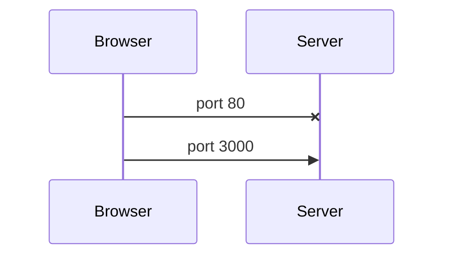
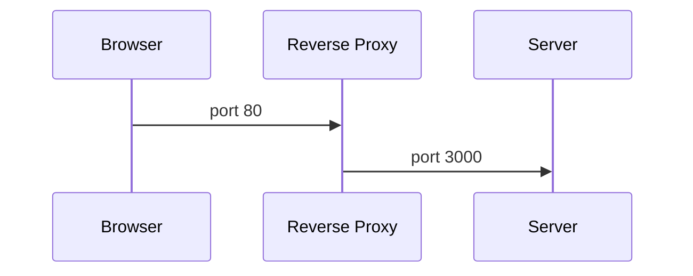
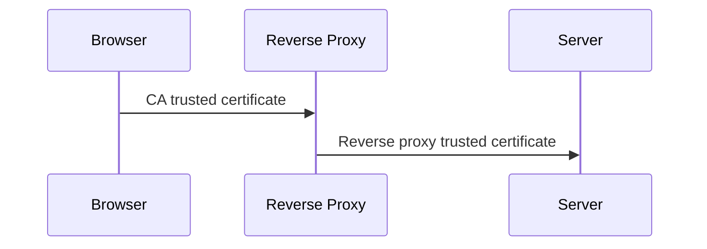
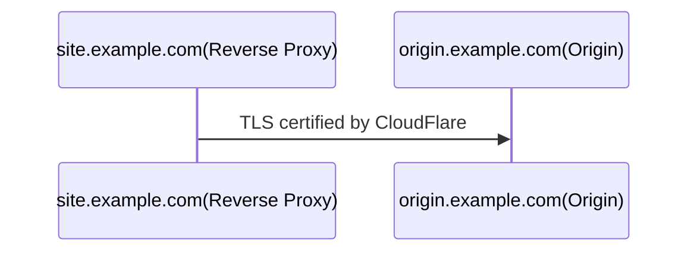

import {LocalizedLink} from '../../../src/i18n'

<!-- vim-markdown-toc GFM -->

- [Principles](#principles)
  - [Use A Custom Port](#use-a-custom-port)
  - [Reverse Proxy](#reverse-proxy)
  - [TLS](#tls)
- [Recommended Practices](#recommended-practices)
  - [Choice of Service Provider](#choice-of-service-provider)
  - [TLS on Origin](#tls-on-origin)
  - [Reverse Proxy](#reverse-proxy-1)

<!-- vim-markdown-toc -->

In certain countries or regions, people are not allowed to maintain their own sites without registering the server, domain or IP to the authority. This restriction has some positive effects that the authority can easily find whoever responsible for a site spreading damaging information like terrorism or children pornography. However this also imposes some very difficult inconvenience, especially to the web developers.

For instance, a developer may want to have a testing server for a project. If the testing site needs to go through the entire registration process, the delivery cycle would be extended unnecessarily just for the registration, not to mention the extra cost of time and money if the registration fails eventually. Moreover, each site must come with a unique testing area as the authority needs to regularly check that the content of the registered site is virtually the same as it was on the registration day.

Here records some useful techniques in work around the censorship of the domain/server. They are actively updated to reflect the latest change. **Do please respect other people's freedom and use them within the legal boundary**.

# Principles

This section records some principles to solve the problem. Based on these principles many different implementations are possible.

## Use A Custom Port

Usually the traffic towards some well-known ports will be scanned and blocked if not found in the registration list. A simple solution would be using a less well-known port to serve. The total amount of ports on the internet is too large to analyze them all in real-time, so a custom port would normally be let go. This is the foundation of any other extended techniques.



Using a custom port brings some difficulties in usage.

1. The visitors now have to type in the port in the url like `www.example.com:8080`.
2. In many browsers, a common url is automatically upgraded to `https`. So you type in `www.example.com` and the browser takes you to `https://www.example.com`. This convenience is not possible if a custom port is used though.

To bypass the inconveniences above, something needs to be done.

## Reverse Proxy

To access the server from a normal port like 80 and 443, a reverse proxy can be used.



In this case the user(browser) treats the reverse proxy as the "server". The revese proxy fetches the content from the real server on behalf of the user and returns the content to the user. In this scenario, if the reverse proxy is trusted by the authority then you have set up a server to serve just like any other functioning server without dealing with the authority.

## TLS

Based on the setup above, a combination of a reverse proxy and the use of a custom port has already given you an HTTP server. However, security is still a concern. TLS encryption needed not only because it prevents attack from bad guys, it also helps hide the content from the oversight, hence the chance of getting into troubles is reduced.

In the circuit shown above, there are 2 connections for every request. Both of the connections need to be protected but different tactics apply.



The certificate of the reverse proxy can be set up in a more convenient way. Many providers like CloudFlare offer it out of the box.

The certificate installed on the server should be trusted by the reverse proxy. Many service providers offer free certificates signed by themselves for this use case.

# Recommended Practices

This section records the practices I exercised based on the above principles.

## Choice of Service Provider

The key component in the tool chain is the reverse proxy. Normally a cloud service provider is the best choice as it has all the functionalities we need out of the box.

There surely are many possible options out there. But I have only used CloudFlare, the most popular one.

CloudFlare is not only a reverse proxy provider, it is also a DNS service provider. Below is how I started to manage my sites and domains using CloudFlare. [The official docs][cf] has stated every detail already. I just need to re-emphasize one point relating to the settings of the domain registrar.

CloudFlare is able to manfrom any registrar, as long as the name server settings are correct. The upstream name server should be set to the ones provided by CloudFlare at the registrar's dashboard. Then the NS records must be set to match the name server settings. This effect of this change may take several hours to ripple through the entire internet.

## TLS on Origin

In the CloudFlare's terminology, the real server serving the site is called "origin". The proxy mode is on by default to hide the IP address of the origin from attackers. All the DNS records resolve to the same reverse proxy only. The proxy fetches the content from the origin and returns to the visitor on every request. The topology has already been discussed in the [principle section](#principles).

One issue remaining is the security of the connection between the CloudFlare's reverse proxy and the origin. In this single channel, the CloudFlare reverse proxy acts as the client and the origin acts as the server. Hence the TLS certificate installed on the origin must be trusted by the reverse proxy. Fortunately CloudFlare offers free TLS certificate for the domains managed by it.



## Reverse Proxy

In CloudFlare, the reverse proxy can be achieved in many ways, the most flexible one being [worker][worker].

[Worker][worker] is a serverless technology offered by CloudFlare. To set up a simple reverse proxy simply masking the true destination, only few lines of code is required to make it work:

```javascript
const ORIGIN = "origin.example.com";
const PORT = `2096`;
addEventListener("fetch", (event) => {
  event.passThroughOnException();
  const url = new URL(event.request.url);
  url.port = PORT;
  url.hostname = ORIGIN;
  const request = new Request(url, event.request);
  return event.respondWith(fetch(request));
});
```

The worker needs to be configured with a route(subdomain) for convenience, otherwise the access url is something randomized and long.

[cf]: https://support.cloudflare.com/hc/en-us/articles/201720164-Creating-a-Cloudflare-account-and-adding-a-website#2YulMb5YJTVnMxgAgNWdS2
[worker]: https://workers.cloudflare.com/
[ports]: https://support.cloudflare.com/hc/en-us/articles/200169156-Identifying-network-ports-compatible-with-Cloudflare-s-proxy#:~:text=HTTPS%20ports%20supported%20by%20Cloudflare,2083
