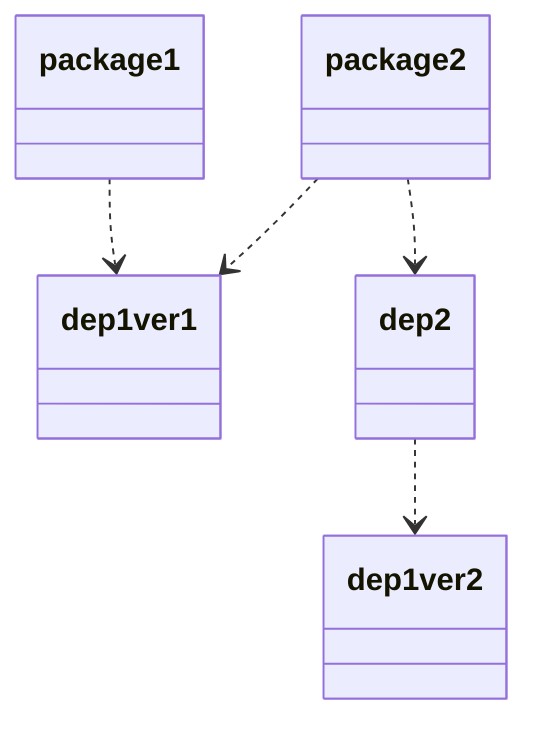
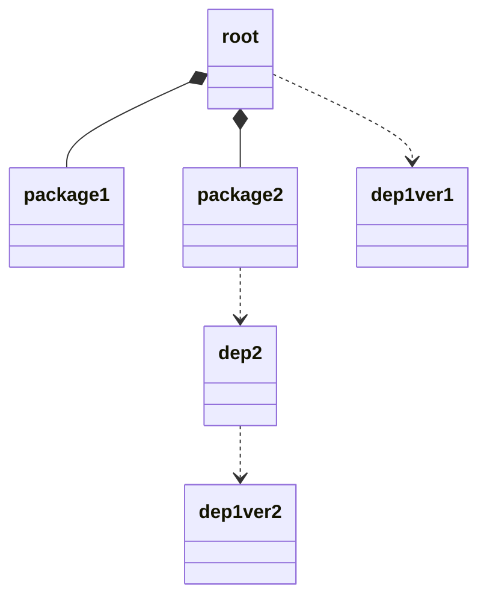

import {LocalizedLink} from '../../../src/i18n'

<!-- vim-markdown-toc GFM -->

- [Different Versions of A Dependency](#different-versions-of-a-dependency)

<!-- vim-markdown-toc -->

[YARN workspaces][workspace] is the most low-level technique to manage a monorepo. Although it came after another monorepo managing tool [lerna][lerna], it is as powerful as any of the competitors.

This article records some of the important findings during my experience with the [workspaces][workspace]. Hence there is not an introductory section here. For the basic concepts, see the [official docs][workspace].

# Different Versions of A Dependency

A very popular selling-point of monorepo is that all sub-packages can now share common dependencies of the same version. It is also easier to keep all the common dependencies updated to the same versions. However, in practice it is not as simple as expected.

In one of my monorepos, there are 2 packages. Both of them depends on the same dependency of the same version; but the nasty bit is that one of a dependencies of a package depends on a different version.

The above diagram shows the relationships between packages and the dependencies I have once encountered. In this case, 2 versions of the `dep 1` hoisted and both need to be installed.

It happens that the version on which the `dep 2` depends was installed in the root, which brings a lot of troubles. For example, if the `dep 1` was typescript and you edited the codes using the tsserver plugin of VSCode, the tsserver would pick up the typescript installed in the root to type-check your codes in the packages. But when the packages are compiled, the typescipt compiler actually used is the ones they each directly depends on. Hence the codes that pass the IDE may break when compiled.

My solution to this problem is to pick the `dep 1` from the packages and install it in the root.

This setup forces the right version of `dep 1` to be installed in the root. But there are some restrictions:

1. the picked dependency must be devDep. Otherwise the the packages installed through npm registry would have a missing dependency. This could be worked around by adding the dependency to the packages also. But it also means that the dep used in development environment and production environment would be different so you have to carefully sync the versions of the dep.
2. the version of the `dep 1` on which the packages depend must be the same because there can be only 1 version of it to be installed in the root.

Hope tsserver and the IDEs will have it fixed properly in the near future.

[workspace]: https://classic.yarnpkg.com/en/docs/workspaces/
[lerna]: https://github.com/lerna/lerna
